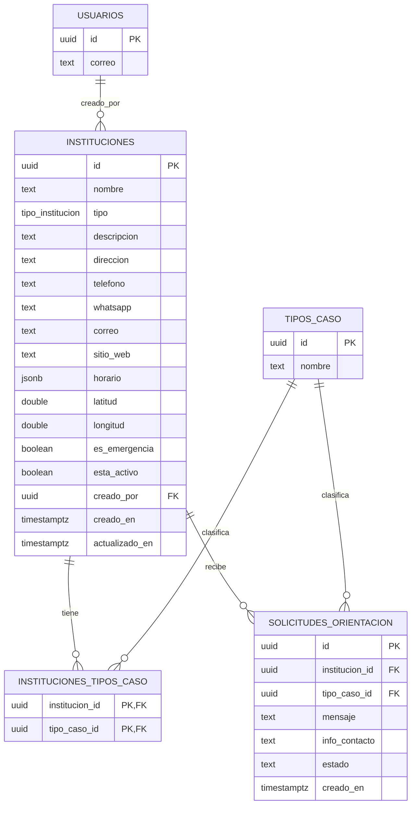

# Directorio institucional — esquema de base de datos

Módulo a cargo de: Churiri Rodriguez Efrain
Stack: Astro (SSR) + PostgreSQL + Drizzle ORM

Depende de la tabla `usuarios`, que administra el módulo CMS (Colque Montoya Carlos Miguel), sobre la misma instancia de Postgres compartida por todo el equipo.

## Diagrama de la base de datos



`USUARIOS` no pertenece a este módulo: la crea y administra el CMS de Miguel, y aquí solo se referencia como llave foránea.

## Migración SQL

```sql
CREATE TYPE tipo_institucion AS ENUM (
  'defensoria',
  'felcv',
  'fiscalia',
  'policia',
  'slim',
  'linea_emergencia',
  'otro'
);

CREATE TABLE instituciones (
  id UUID PRIMARY KEY DEFAULT gen_random_uuid(),
  nombre TEXT NOT NULL,
  tipo tipo_institucion NOT NULL,
  descripcion TEXT,
  direccion TEXT,
  telefono TEXT,
  whatsapp TEXT,
  correo TEXT,
  sitio_web TEXT,
  horario JSONB,
  latitud DOUBLE PRECISION,
  longitud DOUBLE PRECISION,
  es_emergencia BOOLEAN NOT NULL DEFAULT FALSE,
  esta_activo BOOLEAN NOT NULL DEFAULT TRUE,
  creado_por UUID REFERENCES usuarios(id),
  creado_en TIMESTAMPTZ NOT NULL DEFAULT now(),
  actualizado_en TIMESTAMPTZ NOT NULL DEFAULT now()
);

CREATE TABLE tipos_caso (
  id UUID PRIMARY KEY DEFAULT gen_random_uuid(),
  nombre TEXT NOT NULL UNIQUE
);

CREATE TABLE instituciones_tipos_caso (
  institucion_id UUID NOT NULL REFERENCES instituciones(id) ON DELETE CASCADE,
  tipo_caso_id UUID NOT NULL REFERENCES tipos_caso(id) ON DELETE CASCADE,
  PRIMARY KEY (institucion_id, tipo_caso_id)
);

CREATE TABLE solicitudes_orientacion (
  id UUID PRIMARY KEY DEFAULT gen_random_uuid(),
  institucion_id UUID REFERENCES instituciones(id),
  tipo_caso_id UUID REFERENCES tipos_caso(id),
  mensaje TEXT NOT NULL,
  info_contacto TEXT,
  estado TEXT NOT NULL DEFAULT 'pendiente',
  creado_en TIMESTAMPTZ NOT NULL DEFAULT now()
);

CREATE INDEX idx_instituciones_ubicacion ON instituciones (latitud, longitud);
CREATE INDEX idx_instituciones_tipo ON instituciones (tipo);
CREATE INDEX idx_instituciones_emergencia ON instituciones (es_emergencia) WHERE es_emergencia = TRUE;
```

## Seed inicial de `tipos_caso`

```sql
INSERT INTO tipos_caso (nombre) VALUES
  ('violencia_noviazgo'),
  ('grooming'),
  ('sextorsion'),
  ('control_digital'),
  ('consentimiento');
```

## Contrato de API para el módulo SOS

El asistente SOS no lee las tablas directo. Consume estos endpoints:

- `GET /api/instituciones` — lista instituciones activas, filtrable por `tipo` y `tipo_caso`.
- `GET /api/instituciones/cercanas?lat={lat}&lng={lng}&emergencia=true` — devuelve instituciones ordenadas por distancia (Haversine calculado en el backend), filtradas por `es_emergencia = true` cuando se pide.
- `POST /api/solicitudes-orientacion` — crea una solicitud de orientación asociada a una institución o tipo de caso.

Las escrituras (`POST`, `PUT`, `DELETE` sobre `instituciones`) requieren la sesión/token que emite el módulo CMS de Miguel; los `GET` son públicos.

## Pendiente de confirmar con el equipo

- Nombre exacto y columnas de la tabla `usuarios` que va a crear Miguel (se asume `usuarios.id` como `UUID`).
- Mecanismo exacto de sesión/token que expone el CMS para que el directorio y el SOS lo verifiquen.
